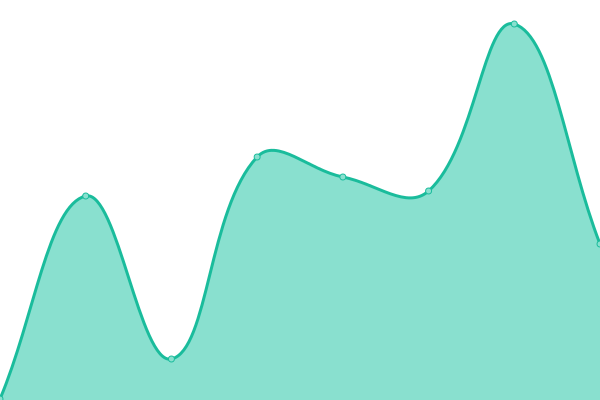
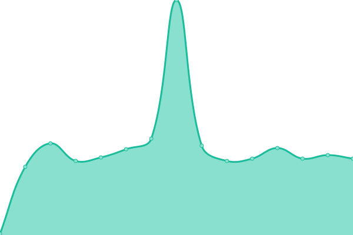

# [📈 Live Status](https://alvaloper.github.io/monitoring): <!--live status--> **🟧 Partial outage**

This repository contains the open-source uptime monitor and status page for [Luis Espinoza](alvaloper.github.io), powered by [Upptime](https://github.com/upptime/upptime).

With [Upptime](https://upptime.js.org), you can get your own unlimited and free uptime monitor and status page, powered entirely by a GitHub repository. We use [Issues](https://github.com/alvaloper/monitoring/issues) as incident reports, [Actions](https://github.com/alvaloper/monitoring/actions) as uptime monitors, and [Pages](https://alvaloper.github.io/monitoring) for the status page.

<!--start: status pages-->
<!-- This summary is generated by Upptime (https://github.com/upptime/upptime) -->
<!-- Do not edit this manually, your changes will be overwritten -->
<!-- prettier-ignore -->
| URL | Status | History | Response Time | Uptime |
| --- | ------ | ------- | ------------- | ------ |
|  [Google](https://www.google.com) | 🟩 Up | [google.yml](https://github.com/alvaloper/monitoring/commits/HEAD/history/google.yml) | 

 79ms
     
 | 

<a href="https://alvaloper.github.io/monitoring/history/google">100.00%</a>
    

|  [Wikipedia](https://en.wikipedia.org) | 🟩 Up | [wikipedia.yml](https://github.com/alvaloper/monitoring/commits/HEAD/history/wikipedia.yml) | 

 145ms
     
 | 

<a href="https://alvaloper.github.io/monitoring/history/wikipedia">100.00%</a>
    

|  [Alvaloper](https://alvaloper.github.io) | 🟩 Up | [alvaloper.yml](https://github.com/alvaloper/monitoring/commits/HEAD/history/alvaloper.yml) | 

 58ms
     
 | 

<a href="https://alvaloper.github.io/monitoring/history/alvaloper">100.00%</a>
    

|  [Test Broken Site](https://thissitedoesnotexist.koj.co) | 🟥 Down | [test-broken-site.yml](https://github.com/alvaloper/monitoring/commits/HEAD/history/test-broken-site.yml) | 

 0ms
     
 | 

<a href="https://alvaloper.github.io/monitoring/history/test-broken-site">100.00%</a>
    

|  [New](https://luisespinozaa.org) | 🟥 Down | [new.yml](https://github.com/alvaloper/monitoring/commits/HEAD/history/new.yml) | 

 0ms
     
 | 

<a href="https://alvaloper.github.io/monitoring/history/new">0.00%</a>
    

|  [New1](https://luisespinozaalva.org) | 🟥 Down | [new1.yml](https://github.com/alvaloper/monitoring/commits/HEAD/history/new1.yml) | 

 0ms
     
 | 

<a href="https://alvaloper.github.io/monitoring/history/new1">0.01%</a>
    

|  [New3](https://google.com.co) | 🟩 Up | [new3.yml](https://github.com/alvaloper/monitoring/commits/HEAD/history/new3.yml) | 

 143ms
     
 | 

<a href="https://alvaloper.github.io/monitoring/history/new3">100.00%</a>
    

|  [New2](https://google.es) | 🟩 Up | [new2.yml](https://github.com/alvaloper/monitoring/commits/HEAD/history/new2.yml) | 

 233ms
     
 | 

<a href="https://alvaloper.github.io/monitoring/history/new2">100.00%</a>
    

|  [IPv6 test](forwardemail.net) | 🟥 Down | [i-pv6-test.yml](https://github.com/alvaloper/monitoring/commits/HEAD/history/i-pv6-test.yml) | 

 0ms
     
 | 

<a href="https://alvaloper.github.io/monitoring/history/i-pv6-test">100.00%</a>
    

<!--end: status pages-->

[**Visit our status website →**](https://alvaloper.github.io/monitoring)

## 📄 License

- Powered by: [Upptime](https://github.com/upptime/upptime)
- Code: [MIT](./LICENSE) © [Anand Chowdhary](https://anandchowdhary.com), supported by [Pabio](https://pabio.com)
- Data in the `./history` directory: [Open Database License](https://opendatacommons.org/licenses/odbl/1-0/)
