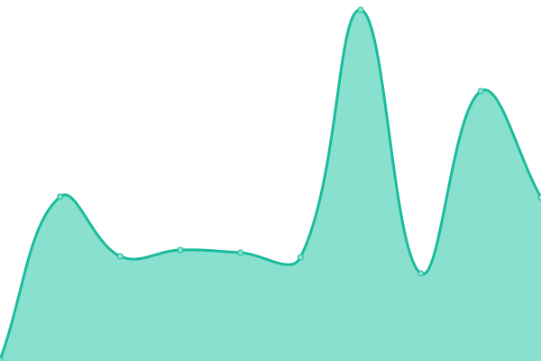

# [📈 Live Status](https://alvaloper.github.io/monitoring): <!--live status--> **Todos los Sistemas estan Funcionando Correctamente**

This repository contains the open-source uptime monitor and status page for [Luis Espinoza](alvaloper.github.io), powered by [Upptime](https://github.com/upptime/upptime).

With [Upptime](https://upptime.js.org), you can get your own unlimited and free uptime monitor and status page, powered entirely by a GitHub repository. We use [Issues](https://github.com/alvaloper/monitoring/issues) as incident reports, [Actions](https://github.com/alvaloper/monitoring/actions) as uptime monitors, and [Pages](https://alvaloper.github.io/monitoring) for the status page.

<!--start: status pages-->
<!-- This summary is generated by Upptime (https://github.com/upptime/upptime) -->
<!-- Do not edit this manually, your changes will be overwritten -->
<!-- prettier-ignore -->
| URL | Status | History | Response Time | Uptime |
| --- | ------ | ------- | ------------- | ------ |
|  [Google](https://www.google.com) | Online(OK) | [google.yml](https://github.com/alvaloper/monitoring/commits/HEAD/history/google.yml) | 

 83ms
     
 | 

<a href="https://alvaloper.github.io/monitoring/history/google">100.00%</a>
    

|  [Wikipedia](https://en.wikipedia.org) | Online(OK) | [wikipedia.yml](https://github.com/alvaloper/monitoring/commits/HEAD/history/wikipedia.yml) | 

 151ms
     
 | 

<a href="https://alvaloper.github.io/monitoring/history/wikipedia">100.00%</a>
    

|  [Alvaloper](https://alvaloper.github.io) | Online(OK) | [alvaloper.yml](https://github.com/alvaloper/monitoring/commits/HEAD/history/alvaloper.yml) | 

 136ms
     
 | 

<a href="https://alvaloper.github.io/monitoring/history/alvaloper">100.00%</a>
    

|  [New](https://youtube.com) | Online(OK) | [new.yml](https://github.com/alvaloper/monitoring/commits/HEAD/history/new.yml) | 

 286ms
     
 | 

<a href="https://alvaloper.github.io/monitoring/history/new">100.00%</a>
    

|  [New1](https://google.com.ar) | Online(OK) | [new1.yml](https://github.com/alvaloper/monitoring/commits/HEAD/history/new1.yml) | 

 299ms
     
 | 

<a href="https://alvaloper.github.io/monitoring/history/new1">100.00%</a>
    

|  [New4](https://google.it) | Online(OK) | [new4.yml](https://github.com/alvaloper/monitoring/commits/HEAD/history/new4.yml) | 

 265ms
     
 | 

<a href="https://alvaloper.github.io/monitoring/history/new4">100.00%</a>
    

|  [Xataka](https://www.xataka.com/) | Online(OK) | [xataka.yml](https://github.com/alvaloper/monitoring/commits/HEAD/history/xataka.yml) | 

 527ms
     
 | 

<a href="https://alvaloper.github.io/monitoring/history/xataka">100.00%</a>
    

|  [Dolar TRM](https://dolar.wilkinsonpc.com.co/) | Online(OK) | [dolar-trm.yml](https://github.com/alvaloper/monitoring/commits/HEAD/history/dolar-trm.yml) | 

 171ms
     
 | 

<a href="https://alvaloper.github.io/monitoring/history/dolar-trm">99.49%</a>
    

|  [Cointelegraph](https://google.de/) | Online(OK) | [cointelegraph.yml](https://github.com/alvaloper/monitoring/commits/HEAD/history/cointelegraph.yml) | 

 344ms
     
 | 

<a href="https://alvaloper.github.io/monitoring/history/cointelegraph">100.00%</a>
    

|  [Pasaportes CUCUTA](https://nortedesantander.gov.co) | Online(OK) | [pasaportes-cucuta.yml](https://github.com/alvaloper/monitoring/commits/HEAD/history/pasaportes-cucuta.yml) | 

 1028ms
     
 | 

<a href="https://alvaloper.github.io/monitoring/history/pasaportes-cucuta">86.14%</a>
    

<!--end: status pages-->

[**Visit our status website →**](https://alvaloper.github.io/monitoring)

## 📄 License

- Powered by: [Upptime](https://github.com/upptime/upptime)
- Code: [MIT](./LICENSE) © [Anand Chowdhary](https://anandchowdhary.com), supported by [Pabio](https://pabio.com)
- Data in the `./history` directory: [Open Database License](https://opendatacommons.org/licenses/odbl/1-0/)
